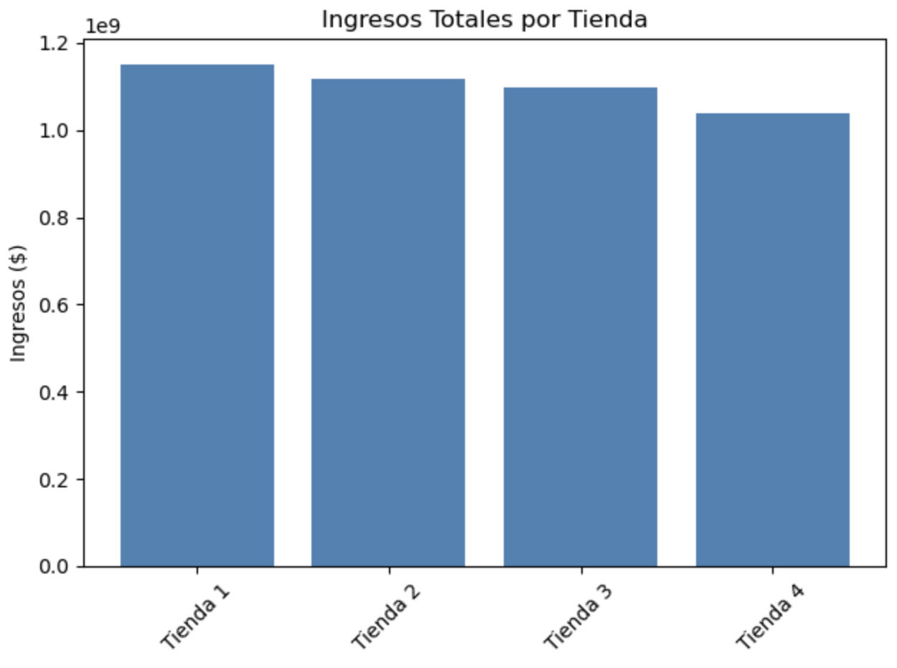
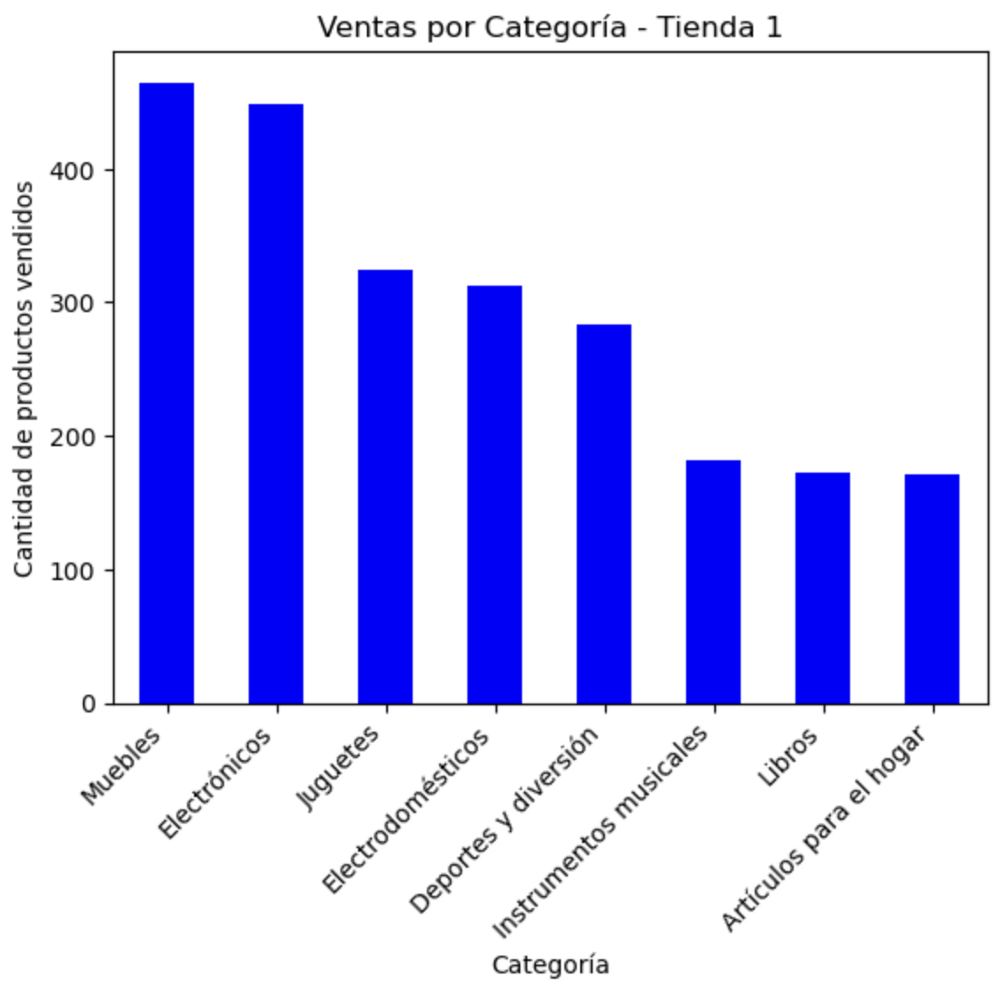
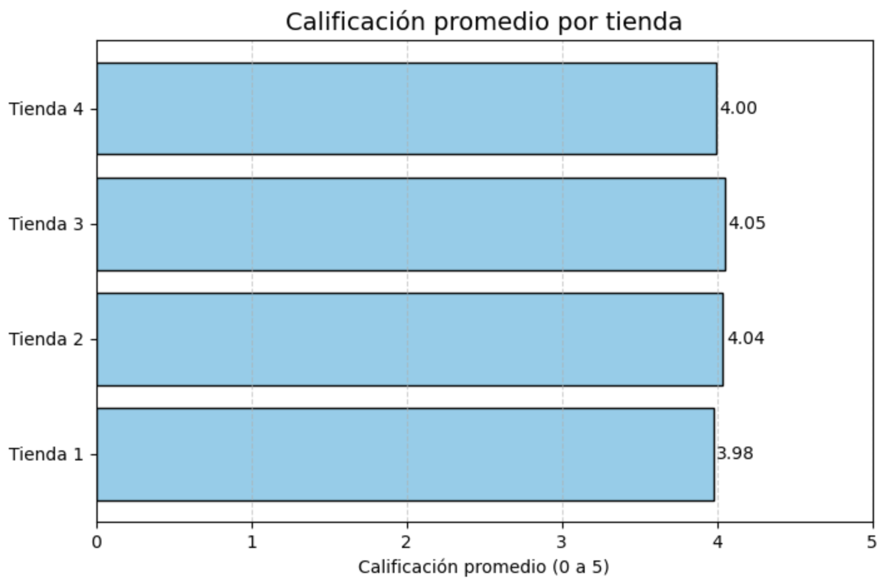
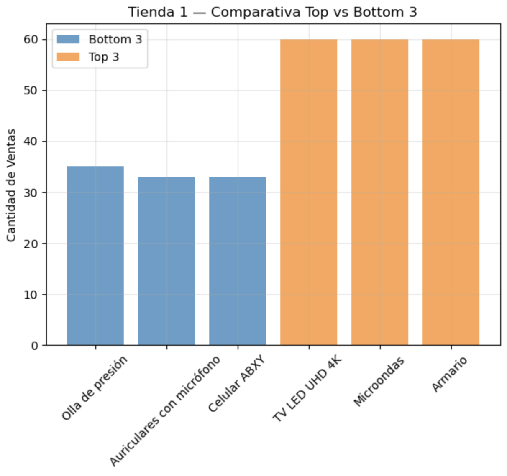
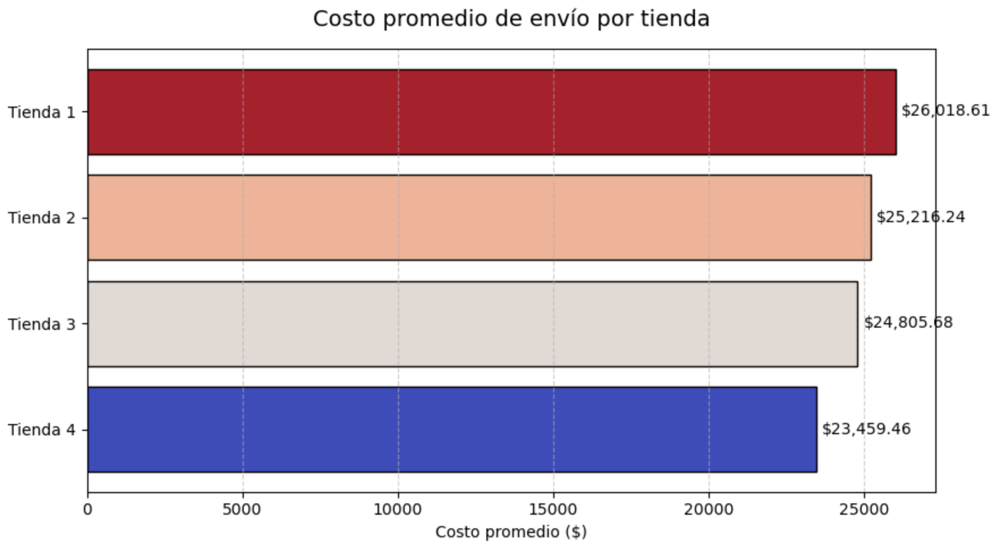
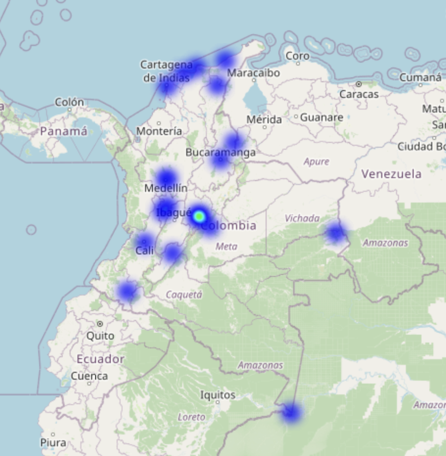

# 🏪 Proyecto Alura Store - Análisis de Tiendas

## 📊 Propósito del Análisis

Este proyecto forma parte del **Challenge de Data Science de Alura Latam**.  
El objetivo es ayudar al Sr. Juan a decidir **qué tienda de su cadena Alura Store debería vender**, basándose en datos reales de desempeño y ventas.

Durante el análisis se aplicaron herramientas de **Python** y **Pandas** para procesar los datos, y **Matplotlib** para crear visualizaciones que faciliten la interpretación.

Se evaluaron los siguientes aspectos:
- 💰 Ingresos totales por tienda  
- 🛍️ Categorías de productos más y menos vendidas  
- ⭐ Calificación promedio de los clientes  
- 📦 Productos más y menos vendidos  
- 🚚 Costo promedio de envío  

---

## 🗂️ Estructura del Proyecto


---
alura_store_project/
│
├── base-de-datos-challenge1=latam/
│ ├── tienda_1.csv
│ ├── tienda_2.csv
│ ├── tienda_3.csv
│ └── tienda_4.csv
│
├── notebooks/
│ └── Alura_store_latam.ipynb
│
├── img/
│ ├── ingresos_tiendas.png
│ ├── categorias_tienda1.png
│ ├── calificaciones_promedio.png
│ ├── productos_top_bottom.png
│ ├── costo_envio_promedio.png
│ └── mapa_ventas.png
    
│
├── README.md
└── requirements.txt


**Descripción:**
- `data/` → Contiene los datasets CSV de cada tienda.  
- `notebooks/` → Incluye el análisis completo en formato Jupyter Notebook.  
- `img/` → Carpeta para almacenar los gráficos generados.  
- `requirements.txt` → Librerías necesarias para ejecutar el análisis.  
- `README.md` → Documento descriptivo del proyecto (este archivo).  

---

## 📈 Ejemplos de Gráficos e Insights

### 1️⃣ Ingresos Totales por Tienda
  
➡️ La Tienda 1 presenta los mayores ingresos globales, mientras que la Tienda 4 muestra el desempeño más bajo.

---

### 2️⃣ Categorías Más Vendidas (Tienda 1)
  
➡️ Las categorías de **Muebles** y **Electronica** dominan las ventas, lo que indica alta demanda en productos tecnológicos.

---

### 3️⃣ Calificaciones Promedio de Clientes
  
➡️ Las tiendas 2 y 3 destacan con calificaciones promedio superiores a **4.0**, reflejando buena satisfacción del cliente.

---

### 4️⃣ Productos Más y Menos Vendidos
  
➡️ Algunos productos tienen una frecuencia de venta notablemente mayor, lo que sugiere oportunidades de promoción cruzada y optimización de inventario.

---

### 5️⃣ Costo Promedio de Envío
  
➡️ La Tienda 3 mantiene un costo de envío competitivo sin sacrificar volumen de ventas, lo que refuerza su eficiencia operativa.

---

### 5️⃣ Costo Promedio de Envío
  
➡️ En la siguiente imagen se puede observar un mapa de ventas, lograndose la mayor concentracion de ventas en la ciudad de Bogotá, debido a su alta demanda generada por su población.

---

## ⚙️ Instrucciones para Ejecutar el Notebook

### 1️⃣ Clonar el repositorio:
```bash
git clone https://github.com/ernes2111/Proyecto-Alura-Store-Analisis-de-Tiendas.git
